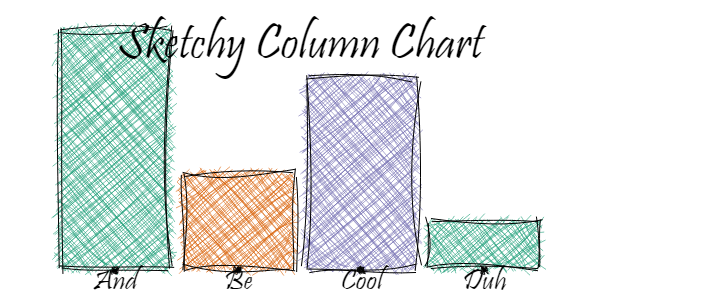

# Sketchy Column Chart

Inspired by & thanks to:  

-  Nicola Rennie's blog on making waffle charts with `roughsf`: <https://nrennie.rbind.io/blog/sketchy-waffle-charts-r/>
-  David Schoch for making `roughsf`: <https://github.com/schochastics/roughsf>,

I made a not so very robust function for making a sketchy column chart.

It needs an input data frame as this:

``` r
the_data <- tibble::tribble(~label, ~x, ~n, ~fill,
                            "And",  1,   5, "#1b9e77",
                            "Be",  2,   2, "#d95f02",
                            "Cool",  3,   4, "#7570b3",
                            "Duh", 4, 1, "#1b9e77")
```

and with the help of

``` r
plot_sketchy_column(some_data = the_data,
                    width_of_columns = 0.9,
                    some_title = "Sketchy Column Chart",
                    size_title = 50,
                    size_label = 30)
```

A sketchy column chart appears:  




For the code, see `sketchy_columns.R`
